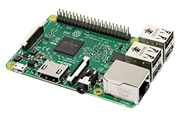
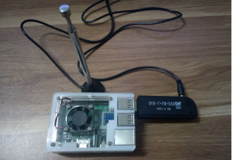
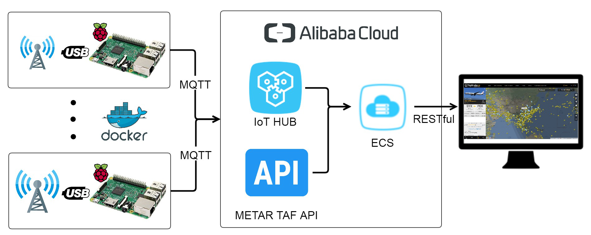
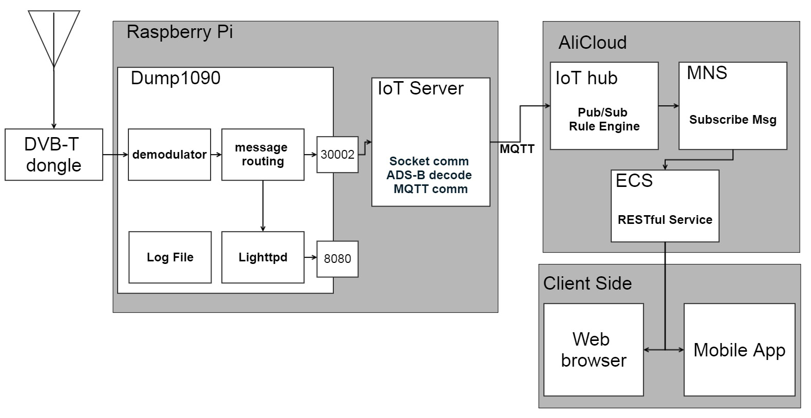

# Proposal

## ADS-B Ground Station

Raspberry Pi(RPi) with Software Defined Radio(SDR) device:

- receive ADS-B messages broadcasted by commercial flights
- decode ADS-B messages from commercial flights
- publish corresponding MQTT messages to IoT platform

## IoT Platform

IoT platform cooperated with elastic compute cloud(ECS), transmits MQTT messages to client’s devices, based on their coordinates, to be able to track flights in the vicinity of the device.

## Deployment

ADS-B Ground Stations can be replicated using virtualization technologies such as Docker to be able to cover large swathes of areas. 

---

# Requirements

## Hardware

Raspberry Pi

RTL-SDR receiver with antenna

## Software

Dump1090 decoder

Java SE Development Kit

ADS-B decoding library

MQTT SDK for IoT platform

Docker

## Cloud platform

IoT Kit

MNS(Message Service)

ECS(Elastic Compute Service)

## Interface(based on Publish–subscribe pattern)

Publish: /OW7PSh0yaaO/{deviceName}/update

Subscribe: /OW7PSh0yaaO/{deviceName}/get

---

# Architecture

---

# Application Workflow

